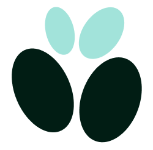
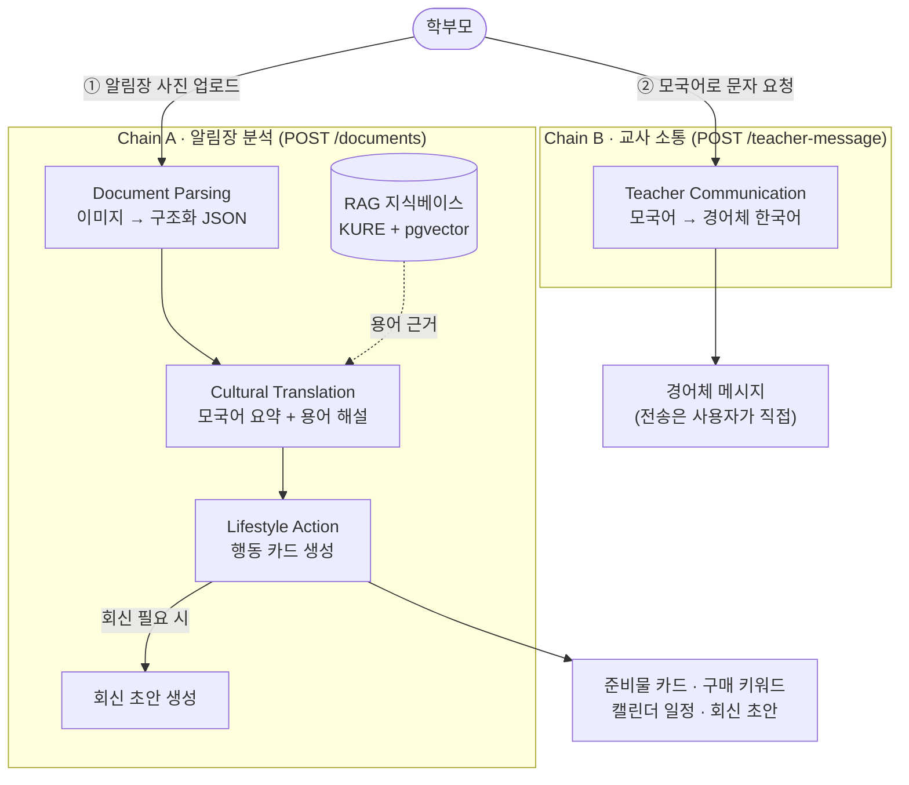
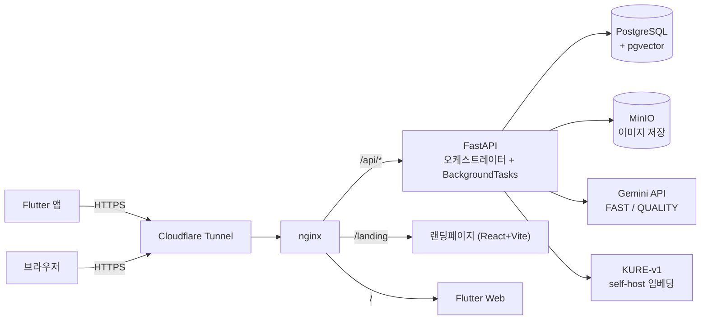

<div align="center">

<!-- TODO(장지원): 로고 에셋 경로 확정 후 주석 해제 -->
<!--  -->

# GAON · 가온

**한국어가 익숙하지 않은 이주배경 학부모가 학교 소식을 이해하고,<br/>필요한 행동까지 끝내도록 돕는 능동형 AI 에이전트**

### `Translation → Action`


**2026 AI·SW중심대학 디지털 경진대회 (SW부문) 출품작**<br/>
팀 **옆구리가시립대** · 서울시립대학교

[핵심 기능](#-핵심-기능) · [서비스 흐름](#-서비스-흐름) · [AI 파이프라인](#-ai-파이프라인) · [아키텍처](#-아키텍처) · [시작하기](#-시작하기)

</div>

---

## 왜 GAON인가요?

한국의 학교는 거의 모든 소식을 **알림장·가정통신문** 한 장으로 전합니다. 한국어가 익숙하지 않은 학부모에게 이 종이 한 장은 두 개의 벽이 됩니다.

|  | 기존 번역기 | GAON |
|---|---|---|
| **이해의 벽** | "급수장", "주간학습안내" 같은 학교 용어를 직역만 제공 | 한국 학교 문화의 맥락을 반영한 모국어 요약 + 용어 해설 (자체 지식베이스 근거) |
| **행동의 벽** | 번역에서 끝 — 준비물 구매, 일정 관리, 선생님 회신은 여전히 학부모의 몫 | 준비물 행동 카드 · 구매 검색 키워드 · 캘린더 등록 · 회신 초안까지 한 번에 정리 |

번역은 시작일 뿐입니다. GAON은 **알림장 사진 한 장에서 출발해, 그 문서가 요구하는 행동이 끝나는 지점까지** 학부모와 함께 갑니다.

## 핵심 기능

### 1. 알림장 분석 — 사진 한 장으로 (Chain A)

카메라 촬영, 갤러리, 스크린샷 — 어떤 이미지든 올리면 파이프라인이 자동으로 이어집니다.

- **구조화 추출** — 문서 종류(알림장·동의서·설문), 날짜·금액·준비물·마감일·회신 필요 여부를 구조화된 데이터로 추출합니다.
- **문화맥락 번역** — 문서 전체 요약과 학교 용어 해설을 모국어로 제공합니다. 해설은 자체 구축한 학교 용어 지식베이스(RAG)의 근거를 바탕으로 합니다.
- **준비물 행동 카드** — 준비물마다 이름·모국어 해설·규격을 정리하고, 구매가 합리적인 실물에만 쿠팡 검색 키워드와 링크를 붙입니다. 학교 배부물이나 제출 서류에는 구매 링크를 억지로 만들지 않습니다.
- **캘린더 등록** — 추출된 마감·행사 일정을 사용자가 골라서 앱 내 캘린더에 저장합니다.
- **회신 초안** — 회신이 필요한 문서라면 편집 가능한 한국어 회신 초안을 함께 생성합니다.
- 처리 중에는 진행 단계(추출 → 구조화 → 번역 → 행동 정리)를 실시간으로 보여줍니다.

### 2. 선생님께 문자 — 정중한 한국어로 (Chain B)

- 상황(결석·진단서·상담)을 고르고 모국어로 쓰면 **경어체 한국어 메시지**를 생성합니다.
- 등록된 자녀의 학년·반을 반영해 자연스럽게 지칭합니다.
- **생성까지만 합니다.** 전송은 학부모가 카카오톡 공유로 직접 — 자동 전송 기능은 만들지 않습니다(제품 결정).

### 3. 다자녀 & 캘린더

- 보호자 1명이 자녀 여러 명을 등록하고, 문서·일정·메시지가 자녀 단위로 귀속됩니다.
- 자녀별 색으로 구분되는 월간 캘린더에서 일정마다 출처 문서를 확인할 수 있습니다.
- 자녀 학년(초등 1~6학년)에 맞춰 행동 카드의 설명 수준을 개인화합니다.

### 4. 온보딩 & 계정

- **Kakao OAuth 로그인** (앱 딥링크 복귀 방식)
- 모국어 하나만 고르면 끝나는 온보딩 — 현재 **베트남어(vi)·중국어(zh)** 지원
- 전 화면 모국어 주 표기 + 한국어 병기
- 회원 탈퇴 시 연쇄 삭제 (DB CASCADE + 저장된 이미지 삭제)

<!-- TODO(장지원): 주요 화면 스크린샷 3~4장 (온보딩 / 행동 카드 / 캘린더 / 문자) -->

## 서비스 흐름

라우팅은 의도를 추측하지 않습니다. **사용자의 화면 동작이 곧 체인 선택**입니다 — 이미지를 올리면 Chain A, 문자 화면에서 요청하면 Chain B.



## AI 파이프라인

### 에이전트 4종

| 에이전트 | 하는 일 | 입력 → 출력 | 모델 티어 |
|---|---|---|---|
| **Document Parsing** | 알림장 이미지에서 구조화 데이터 추출 (멀티모달 단일 호출 — 별도 OCR 없음) | 이미지 → `ExtractedItem` | FAST |
| **Cultural Translation** | 모국어 요약 + 학교 용어 해설 (RAG 근거 주입) | `ExtractedItem` → `TranslatedContent` | QUALITY |
| **Lifestyle Action** | 준비물 행동 카드 · 캘린더 이벤트 생성 (자녀 학년 반영) | → `ActionCard` | FAST |
| **Teacher Communication** | 모국어 입력 → 경어체 한국어 메시지 (Chain A의 회신 초안도 담당) | → `TeacherMessage` | QUALITY |

### LLM — 역할에 맞는 2개 티어

- 고빈도 추출 단계는 **FAST**(`gemini-3-flash-preview`), 경어체·해설·회신 초안처럼 품질에 민감한 단계는 **QUALITY**(`gemini-3.1-pro-preview`)로 분리해 비용과 품질을 함께 잡았습니다. 두 티어 모두 후보 모델 파일럿 비교를 거쳐 선정했습니다.
- 환경변수(`GEMINI_MODEL_FAST` / `GEMINI_MODEL_QUALITY`)로 SKU를 교체할 수 있습니다.
- API 키가 없으면 조용히 가짜 응답으로 넘어가는 대신 **명시적으로 에러**를 냅니다. 개발용 `fake` 모드는 `GAON_LLM_MODE`로 의도적으로만 켭니다.

### RAG — 한국어 학교 용어 지식베이스

- 임베딩은 한국어 특화 모델 **KURE-v1**(1024차원, MIT 라이선스)을 **자체 서버에서 직접 구동**합니다 — 지식베이스 검색을 위해 문서 내용이 외부 임베딩 API로 나가지 않습니다.
- 검색은 PostgreSQL **pgvector**(HNSW·cosine) 기반이며, `content_hash` 멱등 업서트와 출처(source) 단위 교체 재적재를 지원합니다.
- 임베딩 입력에 제목·섹션을 접두해 검색 품질을 끌어올렸고, 저장소에 포함된 평가 러너가 자체 골드셋(39건) 기준 **hit@3 / hit@5 100%**를 게이트로 상시 검증합니다.

## 아키텍처



- **비동기 처리** — 업로드는 즉시 응답하고 Chain A는 FastAPI `BackgroundTasks`로 실행합니다. 앱은 `Document.status`를 폴링해 진행 단계를 표시합니다.
- **스키마 관리** — Alembic 선형 마이그레이션으로 버전을 관리하고, 파괴적 DDL은 `migrate-guard`가 명시 확인 없이는 차단합니다.
- **배포** — `infra/deploy.sh` 한 번으로 pull → build → 백업 → 가드 마이그레이션 → 기동 → 헬스체크까지 이어집니다.

### 기술 스택

| 영역 | 스택 |
|---|---|
| 프론트엔드 | Flutter (모바일 + 웹), 랜딩페이지 React + Vite |
| 백엔드 | FastAPI (Python) + Pydantic, 비동기 BackgroundTasks |
| AI | Gemini 멀티모달 (FAST/QUALITY 이원 티어), KURE-v1 self-host 임베딩 |
| 데이터 | PostgreSQL + pgvector, Alembic, MinIO (S3 호환) |
| 인증 | Kakao OAuth + stateless JWT (HS256) |
| 인프라 | Docker Compose, nginx, Cloudflare Tunnel (공개 HTTPS) |

## 디렉토리 구조

```
gaon/
├── fe/        # Flutter 앱
├── be/        # FastAPI 백엔드 (오케스트레이터 = 엔드포인트 자체)
├── ai/        # 에이전트 4종 + RAG 파이프라인
├── shared/    # shared-schema — FE·BE·AI 공통 타입의 단일 출처
├── web/       # 서비스 소개 랜딩페이지 (React+Vite 정적 사이트)
└── infra/     # 배포·터널·DB 설정 (deploy.sh, nginx, migrate-guard)
```

FE·BE·AI의 모든 인터페이스는 `shared/python/gaon_shared/schema.py`의 공통 타입을 따릅니다(Flutter는 Dart 미러 동기화). 변경 순서는 항상 **설계 문서 → shared-schema → 코드**입니다.

## API 한눈에 보기

| 엔드포인트 | 설명 |
|---|---|
| `GET /auth/kakao/login?client=app` | 카카오 로그인 시작 (완료 시 `gaon://` 딥링크로 복귀) |
| `GET /me` · `POST /auth/logout` | 내 정보 조회 · 로그아웃 |
| `DELETE /auth/me` | 회원 탈퇴 (연쇄 삭제) |
| `POST /onboarding` · `POST /children` | 프로필 + 자녀 등록 |
| `POST /documents` | 알림장 업로드 (multipart 이미지 + `child_id`) → Chain A 백그라운드 실행 |
| `GET /documents/{id}/status` | 진행 단계 폴링 |
| `GET /documents/{id}/result` | 추출·번역·행동 카드 결과 |
| `POST /calendar/events` · `GET /calendar/events` | 선택한 일정 저장 · 조회 (출처 문서 제목 포함) |
| `POST /teacher-message` | Chain B — 경어체 메시지 생성 (전송 엔드포인트는 의도적으로 없음) |
| `GET /health` | `{llm_mode, rag_mode}` — 시연 전 실모드 확인 게이트 |

## 시작하기

### Python (백엔드·AI)

설치 순서가 중요합니다 (`shared → ai → be`):

```bash
pip install -e shared/python && pip install -e "ai[dev]" && pip install -e "be[dev]"

# 테스트 · 린트
pytest
ruff check . && black --check .
```

### 백엔드 스택 배포

```bash
./infra/deploy.sh   # pull → build → 백업 → 가드 마이그레이션 → 기동 → 헬스체크
```

배포 후 `GET /health`로 `llm_mode`·`rag_mode`가 실모드인지 확인하세요.

### Flutter 앱

```bash
cd fe
flutter run --dart-define=GAON_USE_API=true --dart-define=GAON_API_TOKEN=<JWT>
# dart-define 없이 실행하면 mock 저장소로 동작합니다
```

### 주요 환경변수

| 변수 | 위치 | 설명 |
|---|---|---|
| `GAON_LLM_MODE` | BE | `gemini`(기본) / `fake` — 키 부재 시 명시 에러 |
| `GAON_RAG_MODE` | BE | `kb`(기본) / `fake` |
| `GEMINI_MODEL_FAST` / `GEMINI_MODEL_QUALITY` | BE | 모델 SKU 오버라이드 |
| `SESSION_SECRET` | BE | JWT(HS256) 서명 키 |
| `GAON_USE_API` / `GAON_API_TOKEN` | FE (`--dart-define`) | mock ↔ 실서버 전환 |

Gemini·Kakao 키 등 시크릿은 `.env`로 관리하며 커밋하지 않습니다.

## 개인정보 & 보안

아이의 학교생활 정보를 다루는 서비스인 만큼, 최소 수집을 원칙으로 설계했습니다.

- **자녀 이름 = 구분용 별명** — 여러 자녀를 구분하기 위한 표시명일 뿐, 실명을 요구하지 않습니다. 미성년 PII는 최소로만 수집합니다.
- **탈퇴 = 연쇄 삭제** — 회원 탈퇴 시 문서·일정·메시지가 DB CASCADE로 함께 삭제되고, 저장된 이미지도 삭제합니다.
- **인증** — Kakao OAuth + stateless JWT(HS256), 인증 필요 엔드포인트 전면 보호.
- **임베딩 self-host** — 지식베이스 검색 과정에서 문서 내용이 외부 임베딩 API로 전송되지 않습니다.

## 로드맵

- 지원 언어 확대 (필리핀어·태국어 등) · 중·고등 학년 확장
- 손글씨 알림장 폴백 OCR (CLOVA)
- Google Calendar 연동
- 음성 입력 · 대화형 서류 작성
- 이커머스 장바구니 연동 · 학교 알림 플랫폼 연동
- 클라우드 이전 (MinIO → AWS S3 등)

## 팀 옆구리가시립대

| 이름 | 역할 |
|---|---|
| 탕지수 | 팀장 · 기획 / 산출물 총괄 |
| 이태권 | AI 파이프라인 · RAG |
| 장지원 | 프론트엔드 (Flutter · Figma) |
| 이지수 | 백엔드 (FastAPI) |
| 박수빈 | 백엔드 (FastAPI) |
| 손수빈 | 인프라 · 문서 (SSOT) |

## 오픈소스 & 데이터 출처

- **KURE-v1** (MIT) — 한국어 특화 임베딩 모델
- **PostgreSQL · pgvector · MinIO · FastAPI · Flutter** — 핵심 인프라 오픈소스
- **RAG 코퍼스** — 자체 제작 학교 용어 해설 + 공공누리(KOGL) 공공 자료 (출처 명시 적재)

---

<div align="center">

**GAON 가온** — 어떤 아이도 언어 때문에 학교 소식에서 소외되지 않도록.

</div>
